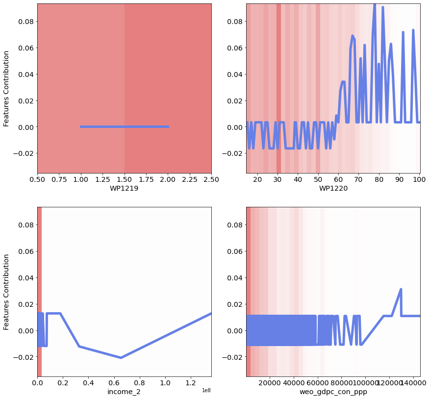

# NAM: Neural Additive Models - Interpretable Machine Learning with Neural Nets

  **[Overview](#overview)**
| **[Installation](#installation)**
| **[Paper](https://arxiv.org/pdf/2004.13912.pdf)**


[](https://arxiv.org/abs/2004.13912)


NAM is a library for generalized additive models research.
Neural Additive Models (NAMs) combine some of the expressivity of DNNs with the inherent intelligibility of generalized additive models. NAMs learn a linear combination of neural networks that each attend to a single input feature. These networks are trained jointly and can learn arbitrarily complex relationships between their input feature and the output.

## Overview

```python
from nam.config import defaults
from nam.data import FoldedDataset, NAMDataset
from nam.models import NAM, get_num_units
from nam.trainer import LitNAM
from nam.utils import *
```

##### Define the experiments configurations

```python
config = defaults()
print(config)
```

```python
>> Config(activation='exu', batch_size=1024, cross_val=False, data_path='data/GALLUP.csv', decay_rate=0.995, device='cpu', dropout=0.5, early_stopping_patience=50, experiment_name='NAM', feature_dropout=0.5, fold_num=1, hidden_sizes=[64, 32], l2_regularization=0.5, logdir='output', lr=0.0003, num_basis_functions=1000, num_epochs=1, num_folds=5, num_models=1, num_splits=3, num_workers=16, optimizer='adam', output_regularization=0.5, regression=False, save_model_frequency=2, save_top_k=3, seed=2021, shuffle=True, units_multiplier=2, use_dnn=False, wandb=True)
```

##### Creating and preprocessing the dataset

```python
import sklearn
housing = sklearn.datasets.fetch_california_housing()

dataset = pd.DataFrame(data=housing.data, columns=housing.feature_names)
dataset['target'] = housing.target

config.regression = True

dataset = NAMDataset(config,
                      data_path=dataset,
                      features_columns=dataset.columns[:-1],
                      targets_column=dataset.columns[-1])


## Getting the training dataloaders
dataloaders = dataset.train_dataloaders()
```

##### Define NAM Model

```python
model = NAM(
  config=config,
  name="NAM_GALLUP",
  num_inputs=len(dataset[0][0]),
  num_units=get_num_units(config, dataset.features),
)
model
```

```python
>>> NAM(
  (feature_nns): ModuleList(
    (0): FeatureNN(
      (model): ModuleList(
        (0): ExU(in_features=1, out_features=1000)
        (1): LinReLU(in_features=1000, out_features=64)
        (2): LinReLU(in_features=64, out_features=32)
        (3): Linear(in_features=32, out_features=1, bias=True)
      )
    )
    (1): FeatureNN(
      (model): ModuleList(
        (0): ExU(in_features=1, out_features=4)
        (1): LinReLU(in_features=4, out_features=64)
        (2): LinReLU(in_features=64, out_features=32)
        (3): Linear(in_features=32, out_features=1, bias=True)
      )
    )
    (2): FeatureNN(
      (model): ModuleList(
        (0): ExU(in_features=1, out_features=184)
        (1): LinReLU(in_features=184, out_features=64)
        (2): LinReLU(in_features=64, out_features=32)
        (3): Linear(in_features=32, out_features=1, bias=True)
      )
    )
  )
)
```

##### Training loop

```python
for fold, (trainloader, valloader) in enumerate(dataloaders):

    tb_logger = TensorBoardLogger(save_dir=config.logdir,
                                name=f'{model.name}',
                                version=f'fold_{fold + 1}')

    checkpoint_callback = ModelCheckpoint(filename=tb_logger.log_dir +
                                        "/{epoch:02d}-{val_loss:.4f}",
                                        monitor='val_loss',
                                        save_top_k=config.save_top_k,
                                        mode='min')

    litmodel = LitNAM(config, model)
    trainer = pl.Trainer(logger=tb_logger,
                       max_epochs=config.num_epochs,
                       checkpoint_callback=checkpoint_callback)
    trainer.fit(litmodel,
              train_dataloader=trainloader,
              val_dataloaders=valloader)


## Testing the trained model
trainer.test(test_dataloaders=dataset.test_dataloaders())

## Output
>>> [{'test_loss': 236.77108764648438,
  'test_loss_epoch': 237.080322265625,
  'Accuracy_metric_epoch': 0.6506563425064087,
  'Accuracy_metric': 0.6458333134651184}]
```


##### Nam Visualization

```
fig1 = plot_mean_feature_importance(litmodel.model, dataset)

fig2 = plot_nams(litmodel.model, dataset, num_cols= 3)
```




## Usage

```bash
$ python main.py -h
usage: Neural Additive Models [-h] [--num_epochs NUM_EPOCHS]
                              [--learning_rate LEARNING_RATE]
                              [--batch_size BATCH_SIZE] --data_path DATA_PATH
                              --features_columns FEATURES_COLUMNS
                              [FEATURES_COLUMNS ...] --targets_column
                              TARGETS_COLUMN [TARGETS_COLUMN ...]
                              [--weights_column WEIGHTS_COLUMN]
                              [--experiment_name EXPERIMENT_NAME]
                              [--regression REGRESSION] [--logdir LOGDIR]
                              [--wandb WANDB]
                              [--hidden_sizes HIDDEN_SIZES [HIDDEN_SIZES ...]]
                              [--activation {exu,relu}] [--dropout DROPOUT]
                              [--feature_dropout FEATURE_DROPOUT]
                              [--decay_rate DECAY_RATE]
                              [--l2_regularization L2_REGULARIZATION]
                              [--output_regularization OUTPUT_REGULARIZATION]
                              [--dataset_name DATASET_NAME] [--seed SEED]
                              [--num_basis_functions NUM_BASIS_FUNCTIONS]
                              [--units_multiplier UNITS_MULTIPLIER]
                              [--shuffle SHUFFLE] [--cross_val CROSS_VAL]
                              [--num_folds NUM_FOLDS]
                              [--num_splits NUM_SPLITS] [--fold_num FOLD_NUM]
                              [--num_models NUM_MODELS]
                              [--early_stopping_patience EARLY_STOPPING_PATIENCE]
                              [--use_dnn USE_DNN] [--save_top_k SAVE_TOP_K]

optional arguments:
  -h, --help            show this help message and exit
  --num_epochs NUM_EPOCHS
                        The number of epochs to run training for.
  --learning_rate LEARNING_RATE
                        Hyperparameter: learning rate.
  --batch_size BATCH_SIZE
                        Hyperparameter: batch size.
  --data_path DATA_PATH
                        The path for the training data
  --features_columns FEATURES_COLUMNS [FEATURES_COLUMNS ...]
                        Name of the feature columns in the dataset
  --targets_column TARGETS_COLUMN [TARGETS_COLUMN ...]
                        Name of the target column in the dataset
  --weights_column WEIGHTS_COLUMN
                        Name of the weights column in the dataset
  --experiment_name EXPERIMENT_NAME
                        The name for the experiment
  --regression REGRESSION
                        Boolean flag indicating whether we are solving a
                        regression task or a classification task.
  --logdir LOGDIR       Path to dir where to store summaries.
  --wandb WANDB         Using wandb for experiments tracking and logging
  --hidden_sizes HIDDEN_SIZES [HIDDEN_SIZES ...]
                        Feature Neural Net hidden sizes
  --activation {exu,relu}
                        Activation function to used in the hidden layer.
                        Possible options: (1) relu, (2) exu
  --dropout DROPOUT     Hyperparameter: Dropout rate
  --feature_dropout FEATURE_DROPOUT
                        Hyperparameter: Prob. with which features are dropped
  --decay_rate DECAY_RATE
                        Hyperparameter: Optimizer decay rate
  --l2_regularization L2_REGULARIZATION
                        Hyperparameter: l2 weight decay
  --output_regularization OUTPUT_REGULARIZATION
                        Hyperparameter: feature reg
  --dataset_name DATASET_NAME
                        Name of the dataset to load for training.
  --seed SEED           seed for torch
  --num_basis_functions NUM_BASIS_FUNCTIONS
                        Number of basis functions to use in a FeatureNN for a
                        real-valued feature.
  --units_multiplier UNITS_MULTIPLIER
                        Number of basis functions for a categorical feature
  --shuffle SHUFFLE     Shuffle the training data
  --cross_val CROSS_VAL
                        Boolean flag indicating whether to perform cross
                        validation or not.
  --num_folds NUM_FOLDS
                        Number of N folds
  --num_splits NUM_SPLITS
                        Number of data splits to use
  --fold_num FOLD_NUM   Index of the fold to be used
  --num_models NUM_MODELS
                        the number of models to train.
  --early_stopping_patience EARLY_STOPPING_PATIENCE
                        Early stopping epochs
  --use_dnn USE_DNN     Deep NN baseline.
  --save_top_k SAVE_TOP_K
                        Indicates the maximum number of recent checkpoint
                        files to keep.
```


## Citing NAM


```bibtex
@misc{kayid2020nams,
  title={Neural additive models Library},
  author={Kayid, Amr and Frosst, Nicholas and Hinton, Geoffrey E},
  year={2020}
}
```

```bibtex
@article{agarwal2020neural,
  title={Neural additive models: Interpretable machine learning with neural nets},
  author={Agarwal, Rishabh and Frosst, Nicholas and Zhang, Xuezhou and Caruana, Rich and Hinton, Geoffrey E},
  journal={arXiv preprint arXiv:2004.13912},
  year={2020}
}
```
